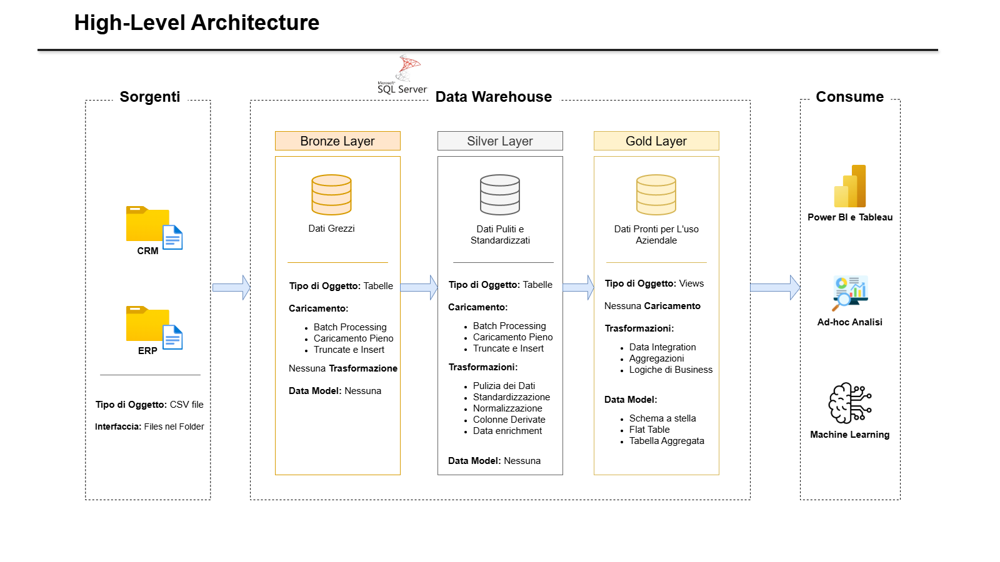

# SQL-Data-Warehouse

## 🚀 I Requisiti del Progetto
**Obiettivi**

Sviluppare un moderno data warehouse utilizzando SQL Server per consolidare dati di vendita, consentendo report analitici e il processo decisionale informato.

**Spechifiche**

- **Fonti dei dati:** Importazione dei dati da due sistemi sorgente (ERP e CRM) forniti come file CSV.
- **Qualità dei dati:** Pulire e risolvere i problemi relativi alla qualità dei dati prima dell'analisi.
- **Integrazione:** Combinare entrambe le fonti in unico modello intuitivo di dati progettato per query analitiche.
- **Ambibto:** Concentrarsi solo sull'ultimo set di dati; non è necessario mantenere lo storico dei dati.
- **Documentazione:** Fornire una documentazione chiara del modello di dati a supporto sia degli stakeholder aziendali che dei team di analisi.

---

**Fasi del Progetto**: Il [link](https://www.notion.so/Progetto-del-SQL-Data-Warehouse-2d1112e6dcd680fdbffcc77916e12b8c?source=copy_link) per tutte le fasi e attività del progetto.

---

## 🏗️ L'architettura del Data Warehouse

L'architettura dei dati per questo progetto segue i livelli **Bronze**, **Silver** e **Gold** dell'architettura Medallion.

1. **Bronze Layer**: Archivia raw data così come sono dai sistemi di origine. I dati vengono importati da file CSV nel database SQL server.
2. **Silver Layer**: Questo livello include processi di pulizia, standardizzazione e normalizzazione dei dati per prepararli all'analisi.
3.  **Gold Layer**: Contiene i dati pronti per l'uso, modellati in uno schema a stella, necessario per la reportistica e l'analisi.

## 🛡️ Licenza
Questo progetto è distribuito sotto **licenza MIT**. Consultare il file [LICENSE](LICENSE) per i dettagli.

## 🌟 Chi sono
Salve! Sono **Tasdid Mahmud** e un neolaureato interessato al ruolo di **Data Engineer**, attualmente impegnato in progetti personali per rafforzare le mie competenze tecniche.

